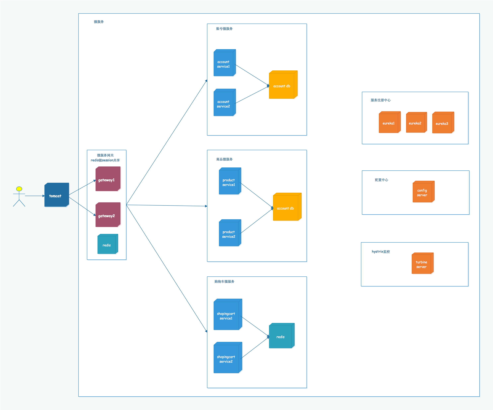

## 系统服务汇总

| 项目名称                | 端口   | 描述        |
| ------------------- | ---- | --------- |
| micro-eureka-server | 8001 | 注册中心      |
| micro-config-server | 8011 | 配置服务      |
| micro-turbine       | 8012 | turbine监控 |
| micro-gateway       | 8021 | 微服务网关     |
| micro-account       | 8031 | 账号微服务     |
| micro-product       | 8032 | 商品微服务     |
| micro-cart          | 8033 | 购物车微服务    |
| micro-view          | 8080 | 前端页面服务    |

## 系统整体部署

